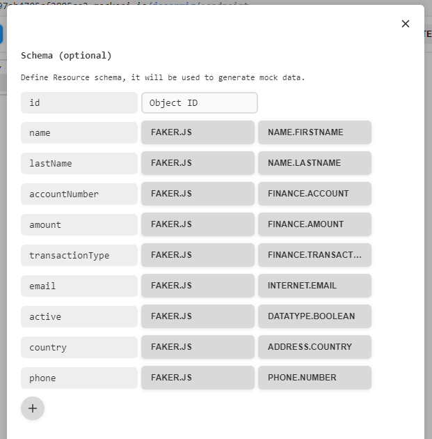
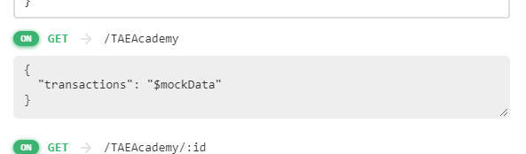

# API TEST WORKSHOP

## Create the following tests using the the Bank transactions endpoint:
<ul>
    <li>@Test 1 > Verify the Endpoint is empty (If it has any data use the DELETE request to clean and
leave it empty)</li>
    <li>@Test 2 > Initialize the POJO with 10 random data (Use the minimal Requirements). Also, make
a code verification for avoiding duplicate email accounts. Then, perform the POST request.</li>
    <li>@Test 3 > Make the GET request, asserting that there are not duplicate email accounts.</li>
    <li>@Test 4 > Add a test to update an existing AccountNumber</li>
</ul>

## Rules
<ul>
    <li>Create an account https://www.mockapi.io/projects and set up an endpoint for Bank transactions (all
information embedded in same API, i.e., only 1 endpoint required)</li>
    <li>Structure the project making the requests reusable, avoid to repeat code or the endpoints, use TestNG
and create a Readme.md with the specifications and steps to run the exercise and add a gitignore.</li>
    <li>For every request please make sure to include at least an assertion for the Status Code (Use POJOs to
manage response data not just the body). Please make sure you use JavaDoc.</li>
</ul>

## Initial setup

Using mockapi a new endpoint has been setup for the project with the following URL 
<a href="https://637976c97eb4705cf2805ce2.mockapi.io/jasarmig/TAEAcademy/">
https://637976c97eb4705cf2805ce2.mockapi.io/jasarmig/TAEAcademy/</a> 

Using the minimal requirements provided a schema is defined under the endpoint configuration options, every field of 
the schema is defined using Faker.js to provide suitable data types at the endpoint, these same fields are used to define
our POJO inside the project.

<figure align="center">

<figcaption>Defined schema</figcaption>
</figure>

Last, a modification for the GET endpoint is needed in order to properly use a stream to deserialize the objects
that come from the endpoint to the testing app. This modification simply adds an attribute "transactions" that will contain an array of all the transactions that
come from the API, this is important beacuse this will help build a proper path.

<figure align="center">

<figcaption>Modified GET endpoint</figcaption>
</figure>

## Test Descriptions - All tests run independently

### Test 1 - cleanEndpoint

**No previous conditions needed**

<ul>
    <li>getRequest() method gets data from the API</li>
    <li>isEndpointEmpty() verifies if there is incoming data</li>
    <li>cleanEndpoint() wipes all information found at the endpoint</li>
</ul>

### Test 2 - initializeEndpointData

**Ideally the API should not contain data**

<ul>
    <li>getRequest() method gets data from the API</li>
    <li>elementsInEndpoint() counts incoming elements</li>
    <li>initializePOJO() adds 10 new transactions verifying there are no duplicate emails</li>
    <li>postRequest() sends the new transactions to the API</li>
</ul>

### Test 3 - noDuplicateEmails

**No previous conditions needed**

<ul>
    <li>getRequest() method gets data from the API</li>
    <li>jsonToObject() transforms json to POJO</li>
    <li>Transactions are counted</li>
    <li>distinctByKey() builds a list of distinct emails</li>
    <li>number of transactions is compared to number of emails</li>
</ul>

### Test 4 - updateAccountNumber

**The endpoint has at least 10 transactions**

<ul>
    <li>Faker generates a random account number</li>
    <li>A random transaction is selected to be updated</li>
    <li>putRequest() is used to update the account number</li>
    <li>getRequest() is sent with the id to verify the account number was updated</li>
</ul>